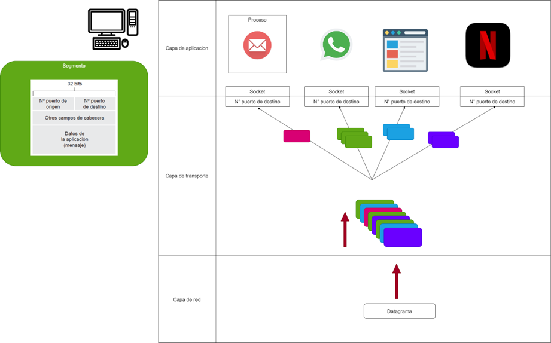
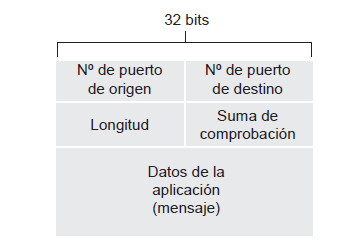

# Encapsulación de datos
La **encapsulación de datos** es un concepto importante en la transmisión de datos que se refiere a la inclusión de datos en un formato específico para su transmisión a través de una red. Los datos se encapsulan en diferentes capas de protocolos de red, como el modelo OSI de siete capas o el modelo TCP/IP de cuatro capas.

# Capas del modelo OSI
## Capa de aplicación
La **capa de aplicación** es la capa más alta del modelo OSI y se encarga de proporcionar servicios de red a las aplicaciones de usuario. Esta capa interactúa directamente con las aplicaciones de usuario y proporciona una interfaz para acceder a los servicios de red. Algunos protocolos comunes de la capa de aplicación incluyen:

| Protocolo | Descripción |
|-----------|-------------|
| HTTP      | Protocolo de transferencia de hipertexto utilizado para la comunicación web. |
| FTP       | Protocolo de transferencia de archivos utilizado para la transferencia de archivos entre sistemas. |
| SMTP      | Protocolo de transferencia de correo simple utilizado para el envío de correos electrónicos. |

En términos de la **capa de aplicación** del modelo OSI o del modelo TCP/IP, cuando hablamos de **desarrollo de aplicaciones de red**, nos referimos a la lógica de los programas que interactúan entre sí a través de la red. Esta capa se encarga de proporcionar los protocolos y servicios que permiten a las aplicaciones intercambiar información de manera coherente, sin preocuparse por los detalles de las capas inferiores (como el transporte o el acceso a la red).

Ejemplo:

1. Has creado un programa en Python llamado `server.py` que contiene una clase `Server`.
2. Esta clase tiene métodos como `subir_archivo` y `bajar_archivo`, que definen cómo el servidor manejará estos procesos.
3. Dices que este servidor no "conoce" los **sockets** directamente, sino que se comunica con una clase `Protocolo` que probablemente maneja la capa de transporte y los sockets.

**Sí, esto puede considerarse como parte de la capa de aplicación**, porque la clase `Server` está diseñada para ofrecer servicios que las aplicaciones cliente pueden consumir (subir y bajar archivos), sin preocuparse por cómo se maneja la conexión subyacente.

En este caso, el hecho de que el servidor no interactúe directamente con los **sockets** sino que lo haga a través de otra clase (`Protocolo`), refuerza la idea de separación de responsabilidades. En la capa de aplicación, el enfoque está en la **lógica y los servicios que ofrece la aplicación** (subida/bajada de archivos), mientras que los detalles de cómo se gestiona la comunicación real (los **sockets** o los **protocolos de transporte** como TCP/UDP) corresponden a capas inferiores (como la de transporte).

En resumen, si el `Server` no se encarga de los detalles de bajo nivel de los **sockets** y sólo se ocupa de la lógica de aplicación (es decir, cómo debe comportarse ante solicitudes de los clientes), claramente estaríamos hablando de la **capa de aplicación**.

## Capa de Transporte
La **capa de transporte** es responsable de la entrega de datos de manera confiable y eficiente entre los dispositivos finales. Esta capa proporciona servicios de transporte de extremo a extremo, como la segmentación y el reensamblaje de datos, el control de flujo y la corrección de errores. Algunos protocolos comunes de la capa de transporte incluyen:

| Protocolo | Descripción |
|-----------|-------------|
| TCP       | Protocolo de control de transmisión utilizado para la transmisión confiable de datos. |
| UDP       | Protocolo de datagramas de usuario utilizado para la transmisión no confiable de datos. |

¿Cuáles son los **servicios** que puede ofrecer un protocolo de la capa de transporte a las aplicaciones que lo invocan? 

Podemos clasificar los posibles servicios de forma bastante general según cuatro parámetros: 
- transferencia de datos fiable: garantiza que los datos lleguen a su destino sin errores.
- tasa de transferencia: garantiza que los datos lleguen a su destino en un tiempo razonable.
- temporización
- seguridad.

Un protocolo de la capa de transporte proporciona una comunicación lógica entre procesos de aplicación que se ejecutan en hosts diferentes. Por comunicación lógica queremos decir que, desde la perspectiva de la aplicación, es como si los hosts que ejecutan los procesos estuvieran conectados directamente; en realidad, los hosts pueden encontrarse en puntos opuestos del planeta, conectados mediante numerosos routers y a través de un amplio rango de tipos de enlace.

Los protocolos de la capa de transporte están implementados en los sistemas terminales, pero no en los routers de la red. En el lado emisor, la capa de transporte convierte los mensajes que recibe procedentes de un proceso de aplicación emisor en paquetes de la capa de transporte, conocidos como segmentos de la capa de transporte en la terminología de Internet.

Como mínimo, la capa de transporte tiene que proporcionar un servicio de multiplexación/demultiplexación que permita transferir los datos entre la capa de red y el proceso de la capa de aplicación correcto.

### Multiplexación y demultiplexación

- **multiplexación** es un proceso mediante el cual se pueden enviar varias señales simultáneamente a través de un mismo medio de transmisión, por ejemplo, un cable o una red de comunicaciones. 

    Para nuestro caso: La tarea de reunir los fragmentos de datos en el host de origen desde los diferentes sockets (de cada proceso), encapsulando cada fragmento de datos con la información de cabecera para crear los segmentos y pasarlos a la capa de red es lo que se denomina multiplexación.
- **demultiplexación**: La tarea de entregar los datos contenidos en un segmento de la capa de transporte al socket correcto es lo que se denomina demultiplexación (imagen anterior)

Basándonos en las explicaciones anteriores, sabemos que la operación de multiplexación que se lleva a cabo en la capa de transporte requiere 
- (1) que los sockets tengan identificadores únicos y 
- (2) que cada segmento tenga campos especiales que indiquen el socket al que tiene que entregarse el segmento puerta.

### Tasa de transferencia
La tasa de transferencia se refiere a la cantidad de datos que se pueden transferir en un período de tiempo determinado. Los protocolos de transporte pueden ofrecer diferentes tasas de transferencia, dependiendo de factores como la congestión de la red, la calidad de la conexión y la capacidad de los dispositivos finales.
Las aplicaciones con requisitos de tasa de transferencia se conocen como **aplicaciones sensibles a la tasa de transferencia**. Por ejemplo, las aplicaciones de transmisión de video en tiempo real requieren una tasa de transferencia constante y suficiente para garantizar una reproducción fluida del video.

### Temporización
La temporización se refiere al tiempo que tardan los datos en ser transmitidos desde el origen hasta el destino. Los protocolos de transporte pueden ofrecer diferentes tiempos de entrega, dependiendo de factores como la latencia de la red, la congestión y la calidad de la conexión. Las aplicaciones con requisitos de temporización se conocen como **aplicaciones sensibles a la temporización**. Por ejemplo, las aplicaciones de videoconferencia requieren una baja latencia para garantizar una comunicación fluida y en tiempo real entre los participantes.

# [Ataques de red](Ataques.md)

# [TCP (Protocolo de Control de Transmisión)](tcp.md)

# UDP
UDP hace casi lo mínimo que un protocolo de transporte debe hacer. Además de la función de multiplexación/demultiplexación y de algún mecanismo de
comprobación de errores, no añade nada a IP. 

sin conexión, no orientado a la conexión (UDP no tiene lugar una fase de establecimiento de la conexión entre las entidades de la capa de transporte emisora y receptora previa al envío del segmento), no fiable, sin control de flujo, sin control de congestión, sin retransmisión de paquetes perdidos, sin reordenación de paquetes, sin control de flujo, sin control de congestión, sin retransmisión de paquetes perdidos, sin reordenación de paquetes.

Donde:
- **N° de puerto origen**: es el número de puerto del emisor.
- **N° de puerto destino**: es el número de puerto del receptor.
- **Longitud**: es la longitud total del datagrama UDP, incluyendo la cabecera y los datos.
- **Checksum**:  Suma de comprobacíon es un campo de 16 bits que se utiliza para verificar la integridad del datagrama UDP.
