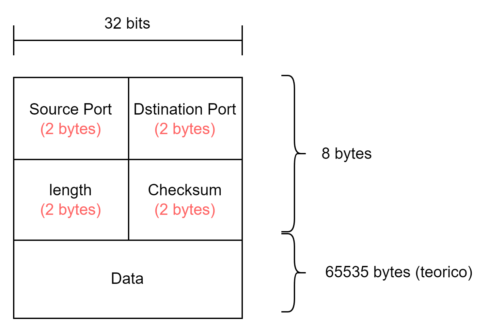

El tamaño de la cabecera (header) UDP es: 64 bits (8 bytes).

Para enviar un archivo a través de la red utilizando UDP, necesitas considerar varios encabezados:

1. **Encabezado de enlace**: Este es el encabezado de la capa de enlace de datos (por ejemplo, Ethernet), que generalmente tiene un tamaño de 14 bytes.
2. **Encabezado de red**: Este es el encabezado de la capa de red (por ejemplo, IP), que tiene un tamaño de 20 bytes para IPv4 y 40 bytes para IPv6.
3. **Encabezado de transporte**: Este es el encabezado de la capa de transporte (UDP), que tiene un tamaño fijo de 8 bytes.
4. **Datos**: El contenido real que deseas enviar.

En cuanto al tamaño máximo de los datos que puedes enviar en un solo datagrama UDP, depende del tamaño máximo de la unidad de transmisión (MTU) de la red. El tamaño máximo de un datagrama UDP es de 65,535 bytes, pero esto incluye los encabezados de IP y UDP³. En la práctica, para evitar la fragmentación, es recomendable que el tamaño del datagrama UDP no exceda los 1,472 bytes en una red Ethernet estándar².

Entonces, si consideras todos los encabezados y deseas evitar la fragmentación, el tamaño máximo de los datos que puedes enviar sería aproximadamente:

$$ \text{MTU} - \text{Encabezado IP} - \text{Encabezado UDP} = 1500 - 20 - 8 = 1472 \text{ bytes} $$

# MTU (Maximum Transmission Unit)
La unidad máxima de transferencia (MTU) es el tamaño máximo de los paquetes de datos que puede aceptar un dispositivo conectado a una red. El tamaño de la MTU se mide en bytes. 

Algunos ejemplos de MTU son: 
- **Ethernet**: El tamaño estándar de la MTU para Ethernet es de 1500 bytes. 
- **Redes de nube privada virtual (VPC)**: La MTU predeterminada para las redes de VPC es de 1460 bytes, pero se puede configurar entre 1300 y 8896 bytes. 
- **Redes móviles**: El tamaño de MTU recomendado es de 1400 bytes, ya que es compatible con la mayoría de las redes móviles a nivel internacional. 

Si el tamaño de la MTU es demasiado alto, puede ocurrir fragmentación, lo que significa que los paquetes de datos se dividen en partes más pequeñas para poder transmitirse. Esto puede afectar el rendimiento de la red y aumentar la probabilidad de pérdida de paquetes.

