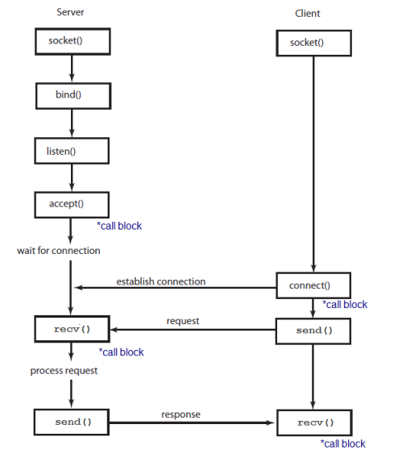
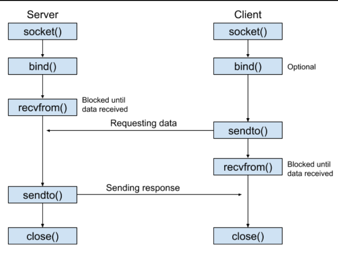
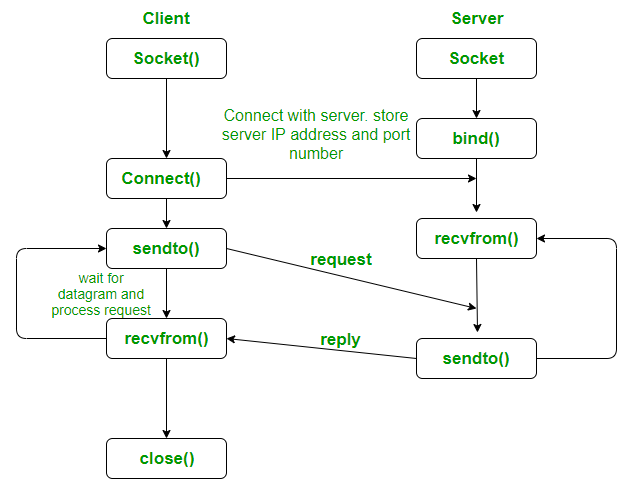

En python existen diferentes funciones:
- `socket()`: Crea un nuevo socket.
- `bind()`: Asocia un socket con una dirección IP y un puerto específicos.
- `listen()`: Pone un socket en modo de escucha para aceptar conexiones entrantes.
- `accept()`: Acepta una conexión entrante y devuelve un nuevo socket para comunicarse con el cliente. 
- `connect()`: Establece una conexión con un servidor remoto.
- `send()`: Envía datos a través del socket.
- `recv()`: Recibe datos a través del socket.
- `sendto()`: Envía datos a una dirección IP y un puerto específicos.
- `recvfrom()`: Recibe datos de una dirección IP y un puerto específicos.
- `close()`: Cierra el socket.
- `gethostname()`: Devuelve el nombre de host de la máquina local.
- `gethostbyname()`: Devuelve la dirección IP de un nombre de host.
- `gethostbyaddr()`: Devuelve el nombre de host y la dirección IP de una dirección IP.
- `getaddrinfo()`: Devuelve una lista de tuplas con información sobre una dirección IP y un puerto.
- `getnameinfo()`: Devuelve el nombre de host y el puerto de una dirección IP.


# TCP vs UDP

## TCP (Transmission Control Protocol)


## UDP (User Datagram Protocol)
 


## Servidor
El método `bind` en sockets se utiliza para asociar el socket con una dirección IP y un puerto específicos en el sistema. Aquí te explico por qué el servidor lo usa y el cliente generalmente no:

### Servidor

El servidor utiliza `bind` para:

1. **Asignar una Dirección y Puerto**: El servidor necesita escuchar en una dirección IP y puerto específicos para recibir las solicitudes de los clientes. Al usar `bind`, el servidor se asegura de que el sistema operativo asigne el socket a esa dirección y puerto.
2. **Esperar Conexiones**: Una vez que el servidor está vinculado a una dirección y puerto, puede empezar a recibir datos de los clientes que se conecten a esa dirección y puerto.

Ejemplo:
```python
server_socket = socket.socket(socket.AF_INET, socket.SOCK_DGRAM)
server_socket.bind(('localhost', 12345))
```

### Cliente

El cliente generalmente **NO** usa `bind` porque:

1. **Asignación Automática**: Cuando el cliente envía datos al servidor, el sistema operativo asigna automáticamente una dirección IP y un puerto disponibles para el socket del cliente. Esto simplifica el código del cliente y evita conflictos de puertos.
2. **Comunicación Directa**: El cliente solo necesita conocer la dirección IP y el puerto del servidor para enviar datos. No necesita estar vinculado a una dirección específica para recibir respuestas, ya que el servidor responderá automáticamente a la dirección y puerto desde los cuales recibió la solicitud.

Ejemplo:
```python
client_socket = socket.socket(socket.AF_INET, socket.SOCK_DGRAM)
client_socket.sendto(message, server_address)
```

### Resumen

- **Servidor**: Usa `bind` para escuchar en una dirección IP y puerto específicos.
- **Cliente**: No necesita `bind` porque el sistema operativo asigna automáticamente una dirección y puerto disponibles.

### Comunicación Full Duplex y Asignación de IP y Puerto

En el contexto de UDP, la comunicación no es estrictamente full duplex en el sentido tradicional de TCP, donde hay una conexión establecida que permite la comunicación bidireccional simultánea. En UDP, cada mensaje es independiente y no hay una conexión persistente. 

- **IP y Puerto del Cliente**: Si el cliente no usa `bind`, el sistema operativo asigna un puerto aleatorio cada vez que el cliente envía un mensaje. Sin embargo, en la práctica, el puerto asignado generalmente permanece constante durante la vida útil del socket, a menos que el socket se cierre y se vuelva a abrir.

### Diferencias en el Uso de Funciones entre TCP y UDP

#### Servidor UDP

- **No usa `listen()` y `accept()`**: Estas funciones son específicas de TCP. `listen()` pone el socket en modo de escucha para conexiones entrantes, y `accept()` acepta una conexión entrante, creando un nuevo socket para la comunicación. En UDP, no hay conexiones persistentes, por lo que estas funciones no son necesarias.
- **Usa `recvfrom()` y `sendto()`**: En UDP, `recvfrom()` se utiliza para recibir datos junto con la dirección del remitente, y `sendto()` se utiliza para enviar datos a una dirección específica.

#### Cliente UDP

- **No usa `connect()`**: En TCP, `connect()` establece una conexión con el servidor. En UDP, no hay una conexión persistente, por lo que `connect()` no es necesario. Sin embargo, en Python, `connect()` puede ser usado con UDP para fijar la dirección del servidor, simplificando el uso de `send()` y `recv()`, pero no es común.
- **Usa `sendto()` y `recvfrom()`**: El cliente UDP envía datos al servidor usando `sendto()` y recibe datos usando `recvfrom()`.

### Ejemplo Comparativo

#### Servidor TCP

```python
import socket

server_socket = socket.socket(socket.AF_INET, socket.SOCK_STREAM)
server_socket.bind(('localhost', 12345))
server_socket.listen(5)

while True:
    client_socket, addr = server_socket.accept()
    data = client_socket.recv(1024)
    client_socket.send(b"Mensaje recibido")
    client_socket.close()
```

#### Cliente TCP

```python
import socket

client_socket = socket.socket(socket.AF_INET, socket.SOCK_STREAM)
client_socket.connect(('localhost', 12345))
client_socket.send(b'Hola, servidor!')
data = client_socket.recv(1024)
print(f"Recibido: {data.decode()}")
client_socket.close()
```

#### Servidor UDP

```python
import socket

server_socket = socket.socket(socket.AF_INET, socket.SOCK_DGRAM)
server_socket.bind(('localhost', 12345))

while True:
    data, addr = server_socket.recvfrom(1024)
    server_socket.sendto(b"Mensaje recibido", addr)
```

#### Cliente UDP

```python
import socket

client_socket = socket.socket(socket.AF_INET, socket.SOCK_DGRAM)
server_address = ('localhost', 12345)
client_socket.sendto(b'Hola, servidor!', server_address)
data, server = client_socket.recvfrom(1024)
print(f"Recibido: {data.decode()}")
client_socket.close()
```

En resumen, las diferencias en las funciones utilizadas se deben a las características fundamentales de los protocolos TCP y UDP. TCP es orientado a conexión y garantiza la entrega de datos en orden, mientras que UDP es sin conexión y no garantiza la entrega ni el orden de los datos.
